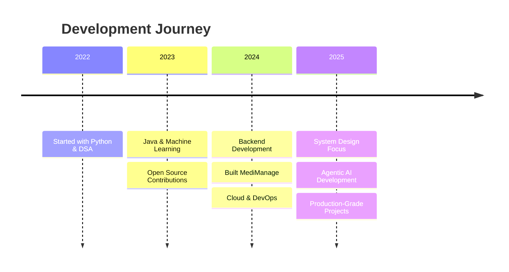

<div align="center">
  
</div>

<h1 align="center">
  Hi there, I'm <a href="https://www.linkedin.com/in/ksvikash236/">Vikash Reddy</a> 
  
</h1>

<div align="center">
  
</div>

<br />

##  About Me

- 🌍 Based in **Nagari, India** 🇮🇳 — Fluent in English, Telugu & Tamil
- 🎓 Aspiring **Software Engineer** focused on **AI & Backend Systems**
- 🚀 Currently architecting **MediManage** (AI Pharma) & **CampusDev** (Student Tech)
- 🎯 **Mission:** Master **System Design** & ship production-grade **Agentic AI** apps
- 💡 **Philosophy:** "Great software is invisible; it just works."

<br />

##  Current Focus 2025

```yaml
🎯 Learning:
  - Advanced System Design & Architecture Patterns
  - Agentic AI & LangChain/LlamaIndex frameworks
  - Kubernetes & Production-Grade DevOps
  - GPU Acceleration with RAPIDS & CUDA

🚀 Building:
  - MediManage: AI-powered pharmaceutical management system
  - CampusDev: Student collaboration & project hub
  - Open Source Contributions: Contributing to AI/ML libraries
```

<br />

##  Featured Projects

<table>
<tr>
<td width="50%" align="center">

### 🏥 MediManage
**AI-Powered Pharmaceutical Management**


A comprehensive pharmaceutical management solution:
- 📊 Real-time Inventory Tracking
- 🤖 AI-driven Stock Predictions
- 💰 Advanced Billing System
- 📈 Business Analytics Dashboard

[View Project →](https://github.com/vikash236/MediManage)

</td>
<td width="50%" align="center">

### 🎓 CampusDev
**Student Tech Community Platform**


A platform for student collaboration:
- 👥 Project Collaboration
- 📝 Code Repository Integration
- 🏆 Skill Showcase & Portfolios
- 🔔 Event Management

*Coming Soon*

</td>
</tr>
</table>

<br />

##  Let's Connect!

<div align="center">
  
<table align="center">
  <tr>
    <td align="center" width="96">
      <a href="https://www.linkedin.com/in/ksvikash236/">
        
      </a>
      <br>LinkedIn
    </td>
    <td align="center" width="96">
      <a href="mailto:ksvikash236@gmail.com">
        
      </a>
      <br>Gmail
    </td>
    <td align="center" width="96">
      <a href="https://github.com/vikash236">
        
      </a>
      <br>GitHub
    </td>
    <td align="center" width="96">
      <a href="https://x.com/KsVikashRe84251">
        
      </a>
      <br>Twitter
    </td>
  </tr>
</table>

</div>

<br />

##  Tech Stack & Tools

###  Programming Languages

<table align="center">
  <tr>
    <td align="center" width="110">
      
      <br><b>Python</b>
    </td>
    <td align="center" width="110">
      
      <br><b>Java</b>
    </td>
    <td align="center" width="110">
      
      <br><b>C++</b>
    </td>
    <td align="center" width="110">
      
      <br><b>C</b>
    </td>
    <td align="center" width="110">
      
      <br><b>Go</b>
    </td>
    <td align="center" width="110">
      
      <br><b>JavaScript</b>
    </td>
    <td align="center" width="110">
      
      <br><b>R</b>
    </td>
  </tr>
</table>

###  AI/ML & Data Science

<table align="center">
  <tr>
    <td align="center" width="110">
      
      <br><b>TensorFlow</b>
    </td>
    <td align="center" width="110">
      
      <br><b>PyTorch</b>
    </td>
    <td align="center" width="110">
      
      <br><b>Scikit-learn</b>
    </td>
    <td align="center" width="110">
      
      <br><b>OpenCV</b>
    </td>
    <td align="center" width="110">
      
      <br><b>Anaconda</b>
    </td>
    <td align="center" width="110">
      
      <br><b>RAPIDS</b>
    </td>
    <td align="center" width="110">
      
      <br><b>CUDA</b>
    </td>
  </tr>
  <tr>
    <td align="center" width="110">
      
      <br><b>Pandas</b>
    </td>
    <td align="center" width="110">
      
      <br><b>NumPy</b>
    </td>
    <td align="center" width="110">
      
      <br><b>Matplotlib</b>
    </td>
    <td align="center" width="110">
      
      <br><b>MATLAB</b>
    </td>
    <td align="center" width="110">
      
      <br><b>Jupyter</b>
    </td>
    <td align="center" width="110">
      
      <br><b>Spark ML</b>
    </td>
  </tr>
</table>

###  Cloud & Big Data

<table align="center">
  <tr>
    <td align="center" width="110">
      
      <br><b>AWS</b>
    </td>
    <td align="center" width="110">
      
      <br><b>Azure</b>
    </td>
    <td align="center" width="110">
      
      <br><b>GCP</b>
    </td>
    <td align="center" width="110">
      
      <br><b>Kafka</b>
    </td>
    <td align="center" width="110">
      
      <br><b>Hadoop</b>
    </td>
    <td align="center" width="110">
      
      <br><b>Spark</b>
    </td>
    <td align="center" width="110">
      
      <br><b>Databricks</b>
    </td>
  </tr>
</table>

###  Web & Backend

<table align="center">
  <tr>
    <td align="center" width="110">
      
      <br><b>React</b>
    </td>
    <td align="center" width="110">
      
      <br><b>Django</b>
    </td>
    <td align="center" width="110">
      
      <br><b>FastAPI</b>
    </td>
    <td align="center" width="110">
      
      <br><b>Flask</b>
    </td>
    <td align="center" width="110">
      
      <br><b>GraphQL</b>
    </td>
    <td align="center" width="110">
      
      <br><b>Node.js</b>
    </td>
  </tr>
</table>

###  Databases

<table align="center">
  <tr>
    <td align="center" width="110">
      
      <br><b>MySQL</b>
    </td>
    <td align="center" width="110">
      
      <br><b>PostgreSQL</b>
    </td>
    <td align="center" width="110">
      
      <br><b>MongoDB</b>
    </td>
    <td align="center" width="110">
      
      <br><b>Redis</b>
    </td>
    <td align="center" width="110">
      
      <br><b>SQLite</b>
    </td>
    <td align="center" width="110">
      
      <br><b>SQL Server</b>
    </td>
  </tr>
</table>

###  DevOps & Tools

<table align="center">
  <tr>
    <td align="center" width="110">
      
      <br><b>Docker</b>
    </td>
    <td align="center" width="110">
      
      <br><b>Kubernetes</b>
    </td>
    <td align="center" width="110">
      
      <br><b>Git</b>
    </td>
    <td align="center" width="110">
      
      <br><b>Jenkins</b>
    </td>
    <td align="center" width="110">
      
      <br><b>Linux</b>
    </td>
    <td align="center" width="110">
      
      <br><b>Ansible</b>
    </td>
    <td align="center" width="110">
      
      <br><b>JIRA</b>
    </td>
  </tr>
</table>

<br />

##  GitHub Achievements

<div align="center">
  
</div>

<br />

##  GitHub Stats

<div align="center">
  
  
  <br><br>
  
</div>

<br />

##  Contribution Graph

<div align="center">
  
</div>

<br />

##  My Journey



<br />

##  Fun Facts

- 🎮 Passionate about gaming and exploring new technologies
- 📱 Love building tools that solve real-world problems
- 🌱 Currently diving deep into Kubernetes and Agentic AI
- 💡 Believer in "Learn in Public" philosophy
- 🎯 2025 Goal: Contribute to 10+ major open source projects
- ☕ Coffee enthusiast & late-night coder

<br />

---

<p align="center">
  <b>"Building the future, one commit at a time."</b>
</p>

<p align="center">
  <b>Thanks for visiting! ⭐ Show some love by starring repositories you like!</b>
</p>

<div align="center">


</div>


