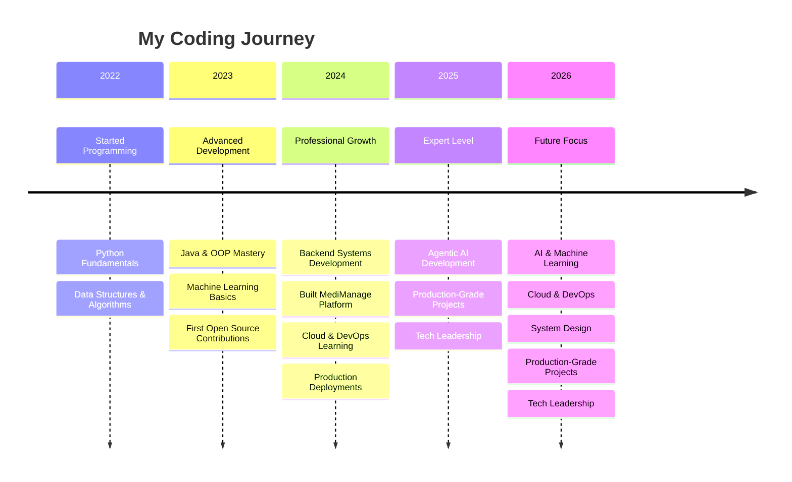

<div align="center">
  
# Hi there, I'm <a href="https://www.linkedin.com/in/ksvikash236/">Vikash Reddy</a> 


<br/>


</div>

---

##  About Me

```typescript
const vikash = {
    location: "Nagari, India 🇮🇳",
    languages: ["English", "Telugu", "Tamil"],
    title: "Aspiring Software Engineer",
    focus: ["AI & Machine Learning", "Backend Systems", "Cloud Architecture"],
    currentProjects: {
        MediManage: "AI-powered pharmaceutical management",
        CampusDev: "Student collaboration platform"
    },
    learning: [
        "System Design & Architecture Patterns",
        "Agentic AI (LangChain, LlamaIndex)",
        "Kubernetes & Production DevOps",
        "GPU Acceleration (RAPIDS, CUDA)"
    ],
    philosophy: "Great software is invisible; it just works.",
    goal2025: "Master System Design & Ship Production-Grade Agentic AI Apps"
};
```

---

##  2025 Focus Areas

<table align="center">
<tr>
<td width="33%" align="center">

### 🎯 Learning
- System Design Patterns
- Agentic AI Frameworks
- Kubernetes at Scale
- GPU Programming

</td>
<td width="33%" align="center">

### 🚀 Building
- MediManage AI System
- CampusDev Platform
- Open Source Contributions
- Technical Blog

</td>
<td width="34%" align="center">

### 📚 Reading
- Designing Data-Intensive Apps
- System Design Interview
- Deep Learning Papers
- Cloud Architecture

</td>
</tr>
</table>

---

##  Featured Projects

<div align="center">

<table>
<tr>
<td width="50%" align="center">

### 🏥 MediManage
**AI-Powered Pharmaceutical Management System**

<p align="center">
  
  
  
</p>

**Key Features:**
- 📊 Real-time Inventory Tracking
- 🤖 AI-driven Stock Predictions
- 💰 Advanced Billing System
- 📈 Business Analytics Dashboard

<a href="https://github.com/vikash236/MediManage">
  
</a>

</td>
<td width="50%" align="center">

### 🎓 CampusDev
**Student Tech Community Platform**

<p align="center">
  
  
  
</p>

**Key Features:**
- 👥 Project Collaboration Hub
- 📝 Git Integration
- 🏆 Skill Showcase & Portfolios
- 🔔 Event Management

<p align="center">
  
</p>

</td>
</tr>
</table>

</div>

---

##  Connect With Me

<div align="center">

<table>
  <tr>
    <td align="center" width="120">
      <a href="https://www.linkedin.com/in/ksvikash236/">
        
        <br><b>LinkedIn</b>
      </a>
    </td>
    <td align="center" width="120">
      <a href="mailto:ksvikash236@gmail.com">
        
        <br><b>Email</b>
      </a>
    </td>
    <td align="center" width="120">
      <a href="https://github.com/vikash236">
        
        <br><b>GitHub</b>
      </a>
    </td>
    <td align="center" width="120">
      <a href="https://x.com/KsVikashRe84251">
        
        <br><b>Twitter</b>
      </a>
    </td>
  </tr>
</table>

</div>

---

##  Tech Stack & Tools

<details open>
<summary><b>💻 Programming Languages</b></summary>
<br>

<div align="center">

<table>
<tr>
<td align="center" width="100">
<br><b>Python</b>
</td>
<td align="center" width="100">
<br><b>Java</b>
</td>
<td align="center" width="100">
<br><b>C++</b>
</td>
<td align="center" width="100">
<br><b>JavaScript</b>
</td>
<td align="center" width="100">
<br><b>Go</b>
</td>
<td align="center" width="100">
<br><b>C</b>
</td>
<td align="center" width="100">
<br><b>R</b>
</td>
</tr>
</table>

</div>

</details>

<details open>
<summary><b>🧠 AI/ML & Data Science</b></summary>
<br>

<div align="center">

<table>
<tr>
<td align="center" width="100">
<br><b>TensorFlow</b>
</td>
<td align="center" width="100">
<br><b>PyTorch</b>
</td>
<td align="center" width="100">
<br><b>Scikit-learn</b>
</td>
<td align="center" width="100">
<br><b>OpenCV</b>
</td>
<td align="center" width="100">
<br><b>Anaconda</b>
</td>
<td align="center" width="100">
<br><b>MATLAB</b>
</td>
</tr>
<tr>
<td align="center" width="100">
<br><b>Pandas</b>
</td>
<td align="center" width="100">
<br><b>NumPy</b>
</td>
<td align="center" width="100">
<br><b>Matplotlib</b>
</td>
<td align="center" width="100">
<br><b>Jupyter</b>
</td>
<td align="center" width="100">
<br><b>RAPIDS</b>
</td>
<td align="center" width="100">
<br><b>CUDA</b>
</td>
</tr>
</table>

</div>

</details>

<details open>
<summary><b>☁️ Cloud & Big Data</b></summary>
<br>

<div align="center">

<table>
<tr>
<td align="center" width="100">
<br><b>AWS</b>
</td>
<td align="center" width="100">
<br><b>Azure</b>
</td>
<td align="center" width="100">
<br><b>GCP</b>
</td>
<td align="center" width="100">
<br><b>Kafka</b>
</td>
<td align="center" width="100">
<br><b>Hadoop</b>
</td>
<td align="center" width="100">
<br><b>Spark</b>
</td>
</tr>
</table>

</div>

</details>

<details>
<summary><b>🌐 Web & Backend Frameworks</b></summary>
<br>

<div align="center">

<table>
<tr>
<td align="center" width="100">
<br><b>React</b>
</td>
<td align="center" width="100">
<br><b>Django</b>
</td>
<td align="center" width="100">
<br><b>FastAPI</b>
</td>
<td align="center" width="100">
<br><b>Flask</b>
</td>
<td align="center" width="100">
<br><b>GraphQL</b>
</td>
<td align="center" width="100">
<br><b>Node.js</b>
</td>
</tr>
</table>

</div>

</details>

<details>
<summary><b>🗄️ Databases</b></summary>
<br>

<div align="center">

<table>
<tr>
<td align="center" width="100">
<br><b>MySQL</b>
</td>
<td align="center" width="100">
<br><b>PostgreSQL</b>
</td>
<td align="center" width="100">
<br><b>MongoDB</b>
</td>
<td align="center" width="100">
<br><b>Redis</b>
</td>
<td align="center" width="100">
<br><b>SQLite</b>
</td>
</tr>
</table>

</div>

</details>

<details>
<summary><b>🛠️ DevOps & Tools</b></summary>
<br>

<div align="center">

<table>
<tr>
<td align="center" width="100">
<br><b>Docker</b>
</td>
<td align="center" width="100">
<br><b>Kubernetes</b>
</td>
<td align="center" width="100">
<br><b>Git</b>
</td>
<td align="center" width="100">
<br><b>Jenkins</b>
</td>
<td align="center" width="100">
<br><b>Linux</b>
</td>
<td align="center" width="100">
<br><b>Ansible</b>
</td>
</tr>
</table>

</div>

</details>

---

##  GitHub Statistics

<div align="center">
  

<br/>

<table>
<tr>
<td width="40%" align="center">


</td>
<td width="60%" align="center">


</td>
</tr>
</table>

</div>

---

##  Contribution Snake

<div align="center">
  


</div>

---

##  Development Journey

<div align="center">



</div>

---


<div align="center">

## 🌟 "Building the future, one commit at a time." 🌟


<br/><br/>

**⭐ If you like what you see, show some love by starring repositories! ⭐**

</div>

<p align="center">
  <b>Thanks for your visit to my profile! If you appreciate my work, consider buying me a coffee. 😊</b>
</p>

<p align="center">
  <a href="https://buymeacoffee.com/vikash236" target="_blank">
    
  </a>
</p>


