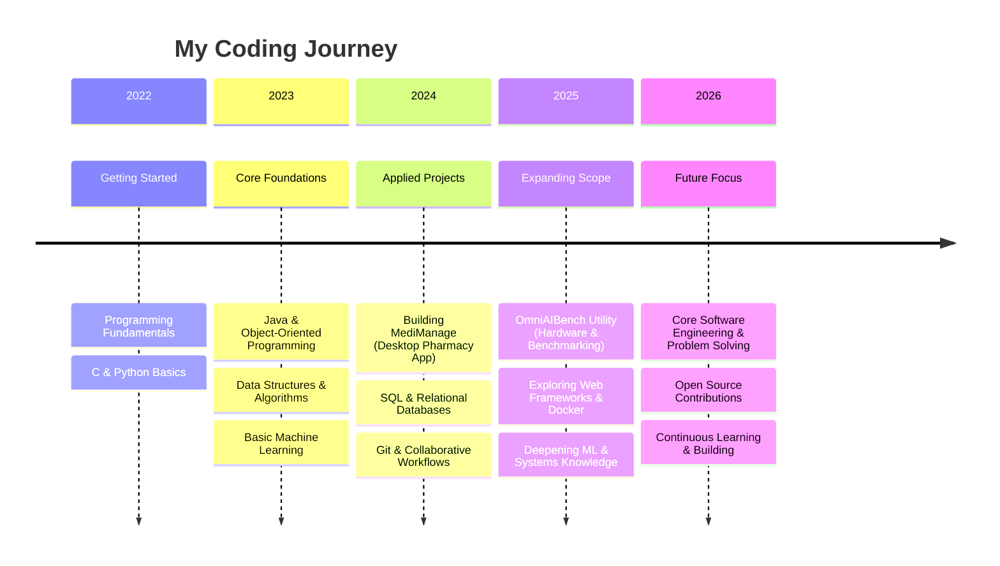

<div align="center">

# Hi there, I'm <a href="https://ksvikash236.vercel.app/">Vikash Reddy</a> 


<br/>

[](https://ksvikash236.vercel.app/)
[](https://www.linkedin.com/in/ksvikash236/)
[](mailto:ksvikash236@gmail.com)


</div>

---

##  About Me

```typescript
const vikash = {
    location: "Nagari, Andhra Pradesh, India 🇮🇳",
    education: "B.Tech CSE — JNTUA College of Engineering, Kalikiri",
    languages: ["English", "Telugu", "Tamil"],
    title: "B.Tech CSE Student & Aspiring Software Engineer",
    portfolio: "https://ksvikash236.vercel.app/",
    focus: ["Software Engineering", "AI & Machine Learning", "Backend & Systems"],
    currentProjects: {
        MediManage: "Desktop pharmacy management app with local AI assistance",
        OmniAIBench: "Hardware monitoring & CPU benchmark utility (WIP)"
    },
    exploring: [
        "Modern Web Frameworks (FastAPI, Django)",
        "Docker & Containerization",
        "Databases (PostgreSQL, MongoDB)",
        "Computer Vision (OpenCV)"
    ],
    philosophy: "Build solid fundamentals and learn how systems work from first principles.",
    currentGoal: "Strengthen core CS fundamentals, algorithms, and build practical software"
};
```

> I'm a B.Tech Computer Science student at JNTUA College of Engineering, Kalikiri, passionate about software engineering, machine learning, and systems programming. I enjoy building practical, curiosity-driven applications — from developing desktop pharmacy tools with local AI assistance using Java and Python to building system monitoring utilities in C++. Currently focused on strengthening core computer science fundamentals, data structures, and backend development.

---

##  Current Focus Areas

<table align="center">
<tr>
<td width="33%" align="center">

### 🎯 Learning
- Data Structures & Algorithms
- Backend Development & APIs
- Relational Databases (MySQL)
- Core Machine Learning
- Linux & Networking Basics

</td>
<td width="33%" align="center">

### 🚀 Building
- MediManage (Pharmacy App)
- OmniAIBench (Hardware Monitor & Benchmarks)
- Open Source Contributions
- Hands-on Lab Projects

</td>
<td width="34%" align="center">

### 📚 Reading & Exploring
- Modern Web Frameworks
- Computer Systems & OS
- Container Basics (Docker)
- Computer Vision (OpenCV)

</td>
</tr>
</table>

---

##  Featured Projects

<div align="center">

<table>
<tr>
<td width="50%" align="center">

### 🏥 MediManage
**Desktop Pharmacy Management Application**

<p align="center">
  
  
</p>

A desktop pharmacy management application built with JavaFX and SQLite, featuring offline-first data storage and an integrated local Python microservice for AI assistance.

**Key Features:**
- 📊 Real-time Inventory & Low-Stock Alerts
- 🤖 Local AI Microservice (Python & ONNX for offline inference)
- 📷 Barcode Scanner Integration (ZXing)
- 💰 Fast POS Billing & Thermal Receipt Printing
- 📈 Expense Tracking & Profit Calculation
- 🔒 Offline-First Local Storage (SQLite)
- 📄 PDF Invoice Generation (JasperReports / OpenPDF)

<a href="https://github.com/vikash236/MediManage">
  
</a>

</td>
<td width="50%" align="center">

### ⚡ OmniAIBench
**Hardware Monitoring & Benchmark Utility (WIP)**

<p align="center">
  
</p>

An open-source desktop utility built with C/C++ and Qt for Windows to monitor system hardware in real-time, benchmark CPU performance, and track scores locally.

**Key Features:**
- 📡 Real-Time Hardware Detection (CPU, RAM, GPU via Windows WMI)
- 🔧 Multi-Threaded CPU Benchmarking (Single-core & multi-core tests)
- 📊 Hardware Sensor Monitoring (CPU load, temperatures & GPU metrics via PDH/NVML)
- 🏆 Local Score Tracking & Leaderboard (SQLite persistence)
- 🎨 Native Desktop UI (VS Code Dark-inspired theme built with Qt)

<a href="https://github.com/vikash236/OmniAIBench">
  
</a>

</td>
</tr>
</table>

</div>

---

##  Tech Stack & Skills

<details open>
<summary><b>💻 Programming Languages</b></summary>
<br>

<div align="center">

<table>
<tr>
<td align="center" width="100">
<br><b>Rust</b>
</td>
<td align="center" width="100">
<br><b>Python</b>
</td>
<td align="center" width="100">
<br><b>Java</b>
</td>
<td align="center" width="100">
<br><b>C</b>
</td>
<td align="center" width="100">
<br><b>R</b>
</td>
</tr>
</table>

</div>

</details>

<details open>
<summary><b>🧠 Machine Learning & Data Science</b></summary>
<br>

<div align="center">

<table>
<tr>
<td align="center" width="100">
<br><b>TensorFlow</b>
</td>
<td align="center" width="100">
<br><b>PyTorch</b>
</td>
<td align="center" width="100">
<br><b>Scikit-learn</b>
</td>
<td align="center" width="100">
<br><b>Pandas</b>
</td>
<td align="center" width="100">
<br><b>NumPy</b>
</td>
<td align="center" width="100">
<br><b>Matplotlib</b>
</td>
</tr>
</table>

</div>

</details>

<details open>
<summary><b>🌐 Web & Backend</b></summary>
<br>

<div align="center">

<table>
<tr>
<td align="center" width="100">
<br><b>React</b>
</td>
<td align="center" width="100">
<br><b>Node.js</b>
</td>
</tr>
</table>

</div>

</details>

<details open>
<summary><b>🗄️ Database</b></summary>
<br>

<div align="center">

<table>
<tr>
<td align="center" width="100">
<br><b>MySQL</b>
</td>
</tr>
</table>

</div>

</details>

<details open>
<summary><b>🛠️ Tools & Networking</b></summary>
<br>

<div align="center">

<table>
<tr>
<td align="center" width="100">
<br><b>Git</b>
</td>
<td align="center" width="100">
<br><b>Linux</b>
</td>
<td align="center" width="100">
<br><b>Networking</b>
</td>
</tr>
</table>

</div>

</details>

---

##  Currently Exploring

> Technologies, frameworks, and tools I am actively exploring and learning through hands-on practice.

<div align="center">

<table>
<tr>
<td align="center" width="100">
<br><b>OpenCV</b>
</td>
<td align="center" width="100">
<br><b>Django</b>
</td>
<td align="center" width="100">
<br><b>FastAPI</b>
</td>
<td align="center" width="100">
<br><b>GraphQL</b>
</td>
<td align="center" width="100">
<br><b>PostgreSQL</b>
</td>
<td align="center" width="100">
<br><b>MongoDB</b>
</td>
<td align="center" width="100">
<br><b>Docker</b>
</td>
</tr>
</table>

</div>

---

##  GitHub Statistics

<div align="center">
  

<br/>

<table>
<tr>
<td width="40%" align="center">


</td>
<td width="60%" align="center">


</td>
</tr>
</table>

</div>

---

##  Contribution Snake

<div align="center">
  


</div>

---

##  Development Journey

<div align="center">


```mermaid
timeline
    title My Coding Journey
    section 2022
        Getting Started : Programming Fundamentals
                        : C & Python Basics
    section 2023
        Core Foundations : Java & Object-Oriented Programming
                         : Data Structures & Algorithms
                         : Basic Machine Learning
    section 2024
        Applied Projects : Building MediManage (Desktop Pharmacy App)
                         : SQL & Relational Databases
                         : Git & Collaborative Workflows
    section 2025
        Expanding Scope : OmniAIBench Utility (Hardware & Benchmarking)
                        : Exploring Web Frameworks & Docker
                        : Deepening ML & Systems Knowledge
    section 2026
        Future Focus : Core Software Engineering & Problem Solving
                     : Open Source Contributions
                     : Continuous Learning & Building
```

</div>

---

##  Connect With Me

<div align="center">

<table>
  <tr>
    <td align="center" width="120">
      <a href="https://ksvikash236.vercel.app/">
        
        <br><b>Portfolio</b>
      </a>
    </td>
    <td align="center" width="120">
      <a href="https://www.linkedin.com/in/ksvikash236/">
        
        <br><b>LinkedIn</b>
      </a>
    </td>
    <td align="center" width="120">
      <a href="mailto:ksvikash236@gmail.com">
        
        <br><b>Email</b>
      </a>
    </td>
    <td align="center" width="120">
      <a href="https://github.com/vikash236">
        
        <br><b>GitHub</b>
      </a>
    </td>
    <td align="center" width="120">
      <a href="https://x.com/KsVikashRe84251">
        
        <br><b>Twitter</b>
      </a>
    </td>
  </tr>
</table>

</div>

---

<div align="center">

## 🌟 "Building the future, one commit at a time." 🌟

<br/>

**⭐ If you like what you see, show some love by starring repositories! ⭐**

</div>

<p align="center">
  <b>Thanks for visiting my profile! If you appreciate my work, consider buying me a coffee. 😊</b>
</p>

<p align="center">
  <a href="https://buymeacoffee.com/vikash236" target="_blank">
    
  </a>
</p>


